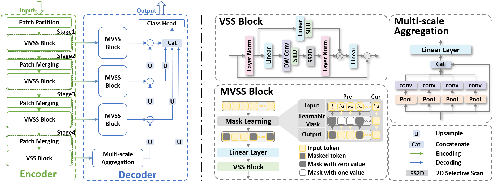

# MaskViM: Domain Generalized Semantic Segmentation with State Space Models

Authors: Jiahao Li, Yang Lu, Yuan Xie, Yanyun Qu*.     *Corresponding author

[[paper](https://ojs.aaai.org/index.php/AAAI/article/download/32502/34657)] 

> **Abstract: Domain Generalized Semantic Segmentation (DGSS) aims to utilize segmentation model training on known source domains to make predictions on unknown target domains. Currently, there are two network architectures: one based on Convolutional Neural Networks (CNNs) and the other based on Visual Transformers (ViTs). However, both CNN-based and ViT-based DGSS methods face challenges: the former lacks a global receptive field, while the latter requires more computational demands. Drawing inspiration from State Space Models (SSMs), which not only possess a global receptive field but also maintain linear complexity, we propose SSM-based method for achieving DGSS. In this work, we first elucidate why does *mask* make sense in SSM-based DGSS and propose our *mask* learning mechanism. Leveraging this mechanism, we present our *Mask Vision Mamba* network (MaskViM), a model for SSM-based DGSS, and design our *mask* loss to optimize MaskViM. Our method achieves superior performance on four diverse DGSS setting, which demonstrates the effectiveness of our method.** 
>
> <p align="center">
> 
> </p>

## News
* **2024-12** :loudspeaker: Our work, [MaskViM](https://ojs.aaai.org/index.php/AAAI/article/download/32502/34657), has been accepted by AAAI 2025.
* **2024-08** :rocket: We release the code for MaskViM. 

 # Installation
 Please refer to VMamba ([https://git@github.com:MzeroMiko/VMamba.git](https://github.com/MzeroMiko/VMamba.git))

 # Related Assets \& Acknowledgement

Our work is closely related to the following assets that inspire our implementation. We gratefully thank the authors. 

 - VMamba:  [https://git@github.com:MzeroMiko/VMamba.git](https://github.com/MzeroMiko/VMamba.git)


 ## Related Assets \& Acknowledgement

Our work is closely related to the following assets that inspire our implementation. We gratefully thank the authors. 

 - VMamba:  https://git@github.com:MzeroMiko/VMamba.git


## Citation:
If you find this project useful, please consider citing:
```
@inproceedings{li2025maskvim,
  title={MaskViM: Domain Generalized Semantic Segmentation with State Space Models},
  author={Li, Jiahao and Lu, Yang and Xie, Yuan and Qu, Yanyun},
  booktitle={Proceedings of the AAAI Conference on Artificial Intelligence},
  volume={39},
  number={5},
  pages={4752--4760},
  year={2025}
}
```
